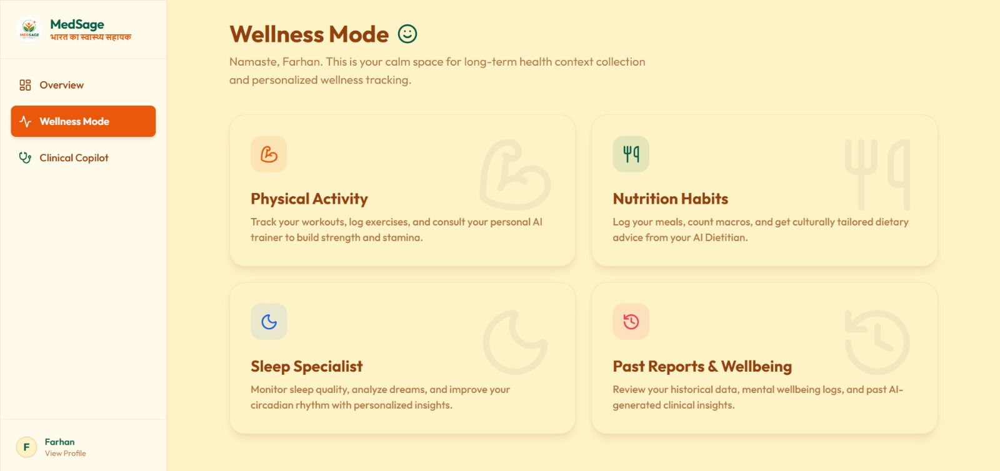
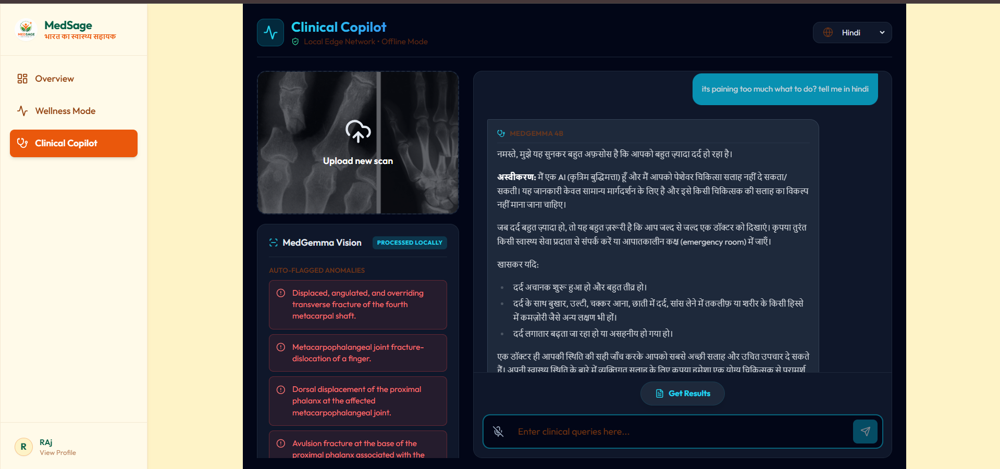
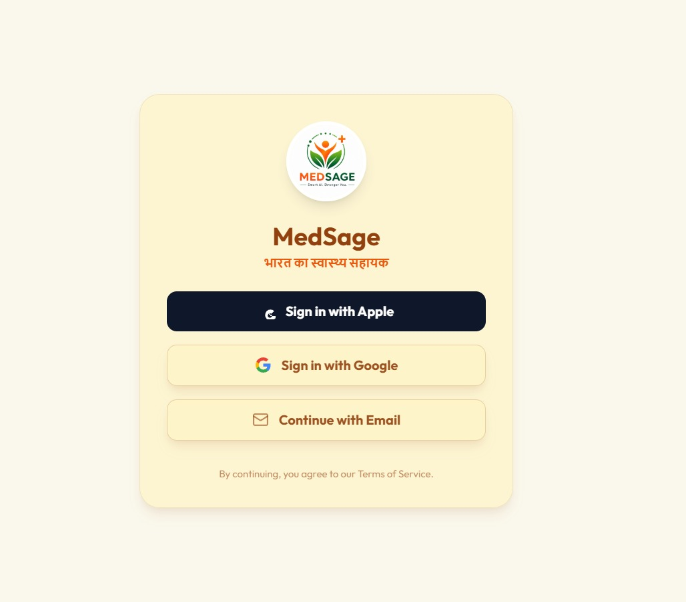
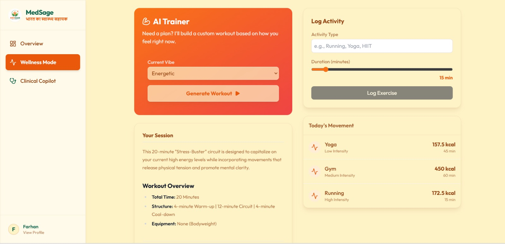
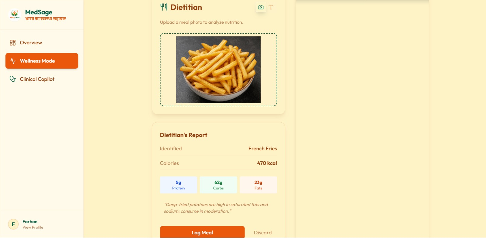
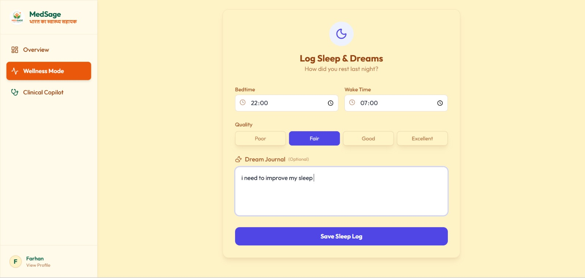
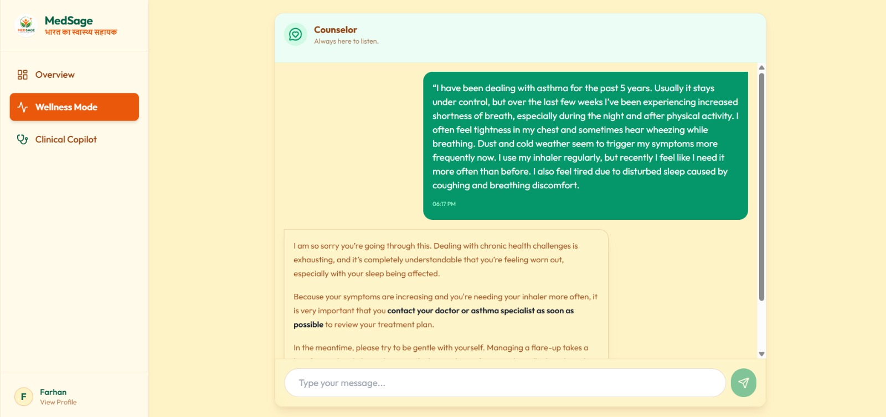
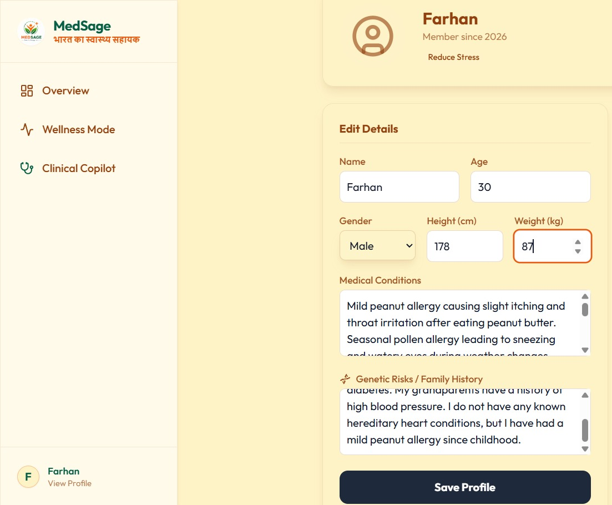
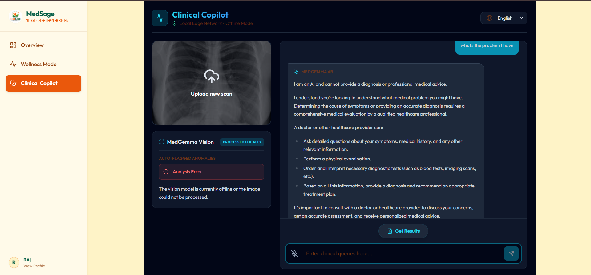

<div align="center">
  
  <h1>MedSage: The Personal Medical Intelligence System</h1>
  <p><strong>Bridging the gap between consumer lifestyle tracking and clinical-grade medical reasoning.</strong></p>
  <h3>🌐 <a href="https://medsage-gamma.vercel.app">Live Demo: medsage-gamma.vercel.app</a></h3>

  
  
  
  
</div>

<br />

<div align="center">
  
</div>

---

## 🌟 What is MedSage?

**MedSage** is a production-grade personal health intelligence platform designed to act as your **on-device medical expert**. It leverages the power of Google's specialized **MedGemma** model and a Multi-Agent Architecture to provide holistic, privacy-preserving health guidance. 

Unlike generalist AI models, MedSage possesses deep specialized knowledge of medical terminology, drug interactions, and clinical guidelines, ensuring all sensitive data processing happens safely and securely.

---

## 🧠 Core Innovation: The Multi-Agent Ecosystem

The system follows an **Agentic Workflow** where specialized AI personas collaborate under a Lead Coordinator to achieve comprehensive health monitoring and personalized recommendations. Every piece of advice is debated, reviewed, and finalized in a "Daily Consensus Meeting".

<div align="center">
  
  
</div>

<br />

### 🩺 Medical Specialist (Powered by MedGemma)
The heart of the system. It acts as the clinical "safety check" for the entire ecosystem.
- **Clinical Q&A:** Answers user health concerns based on specific medical history and genetic risks.
- **Document Analysis:** Parses complex medical tests (blood panels, radiology) to extract key findings for the longitudinal record.
- **Cross-Agent Verification:** Reviews logs from the Dietitian and Trainer to identify potential contraindications (e.g., advising against high-intensity cardio if a heart condition is detected).

<div align="center">
  
</div>

---

### 📱 Application Walkthrough: Screen by Screen

#### 1. Secure Authentication
MedSage provides a secure, seamless entry point ensuring that your sensitive health data is protected from the moment you log in. It supports Apple, Google, and Email sign-in options.
<div align="center">
  
</div>

#### 2. Wellness Mode Dashboard
This is your calm space for long-term health context collection and personalized wellness tracking. From this unified dashboard, you can quickly access your Physical Activity, Nutrition Habits, Sleep Specialist, and Past Reports.
<div align="center">
  
</div>

#### 3. AI Trainer (Physical Activity)
Need a plan? The AI Trainer builds custom workouts based on how you feel right now. Log your exercises, track calories burned, and get a structured session designed specifically for your current energy levels and "vibe".
<div align="center">
  
</div>

#### 4. Dietitian (Nutrition Habits)
Upload a photo of your meal, and the AI Dietitian will automatically identify the food and break down the calories, protein, carbs, and fats. It also provides tailored dietary advice specific to the meal.
<div align="center">
  
</div>

#### 5. Sleep Specialist
Monitor your sleep quality by logging your bedtime, wake time, and a subjective rating. You can even keep a "Dream Journal" to help the AI analyze your circadian rhythm and suggest improvements to your rest.
<div align="center">
  
</div>

#### 6. Personal Health Profile
A centralized place to maintain your static health data including Name, Age, Physical attributes, detailed Medical Conditions, and Genetic Risks/Family History. This data provides the foundational context for the Medical Agent.
<div align="center">
  
</div>

#### 7. Empathetic Counselor
Engage in supportive, responsive conversations with the AI Counselor. It actively listens to your emotional state or physical challenges (like asthma flare-ups) and provides empathetic, practical advice, advising escalation to medical professionals when necessary.
<div align="center">
  
</div>

#### 8. Clinical Copilot (Powered by MedGemma)
The core clinical reasoning engine. In offline mode, you can upload medical documents (like X-ray scans), and the system will process them locally to auto-flag anomalies (e.g., fractures). The text-based MedGemma model then provides detailed, clinical-grade analysis and answers complex health queries in multiple languages.
<div align="center">
  
  <br/>
  
</div>

---

## 📊 Comprehensive User Tracking & Dynamic Memory

MedSage maintains a "Dynamic Memory" that continuously aggregates daily logs, lab results, and personal history. It captures both static data (genetics, allergies) and dynamic daily inputs.

<table align="center">
  <tr>
    <td align="center" width="50%">
      <h4>Personal Profile</h4>
      
    </td>
    <td align="center" width="50%">
      <h4>Medical Records Vault</h4>
      
    </td>
  </tr>
</table>

---

## 🚀 Kaggle MedGemma Impact Challenge

*This application was created as a submission for the **MedGemma Impact Challenge**.*

### Why MedGemma makes an impact:
By utilizing MedGemma instead of a standard general-purpose LLM, MedSage provides:
1. **Clinical Specificity:** MedGemma's fine-tuning on robust medical datasets allows for more precise interpretation of complex medical terminology and risk factors.
2. **Privacy & Security Readiness:** As an open-weights model, MedGemma can be deployed locally or in HIPAA-compliant private environments. This ensures that a user's sensitive medical history **never leaves their controlled infrastructure**.

<div align="center">
  
</div>

---

## 💻 Technical Stack

- **Frontend:** React 19, TypeScript, Vite
- **Styling:** CSS / Tailwind CSS
- **General Reasoning:** Google Gemini 3.1 APIs (handles non-clinical tasks)
- **Clinical Reasoning:** Google MedGemma-4B-IT
- **Database:** Supabase / PostgreSQL / Local SQLite

---

## 🛠️ Getting Started

### Prerequisites
- [Node.js](https://nodejs.org/) (v18 or higher)
- npm or yarn package manager
- Google Gemini API Key

### Installation

1. **Clone the repository**
   ```bash
   git clone https://github.com/yourusername/MedSage.git
   cd MedSage
   ```

2. **Install dependencies**
   ```bash
   npm install
   ```

3. **Environment Setup**
   Create a `.env.local` file in the project root:
   ```env
   VITE_GEMINI_API_KEY=your_gemini_api_key_here
   ```

4. **Run the development server**
   ```bash
   npm run dev
   ```

5. **Start Exploring**
   Open your browser and navigate to `http://localhost:5173` to experience MedSage locally.

---

<div align="center">
  <i>Empowering Personal Health through Localized AI Intelligence.</i>
</div>
