<div align="center">
  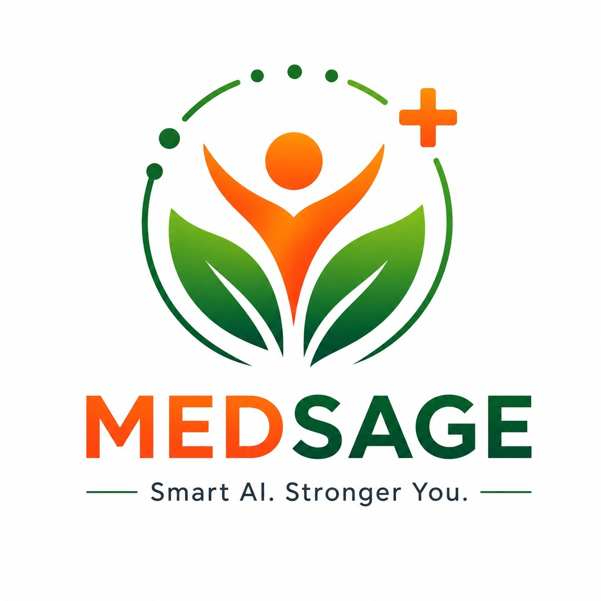
  <h1>MedSage: The Personal Medical Intelligence System</h1>
  <p><strong>Bridging the gap between consumer lifestyle tracking and clinical-grade medical reasoning.</strong></p>

  
  
  
  
</div>

<br />

<div align="center">
  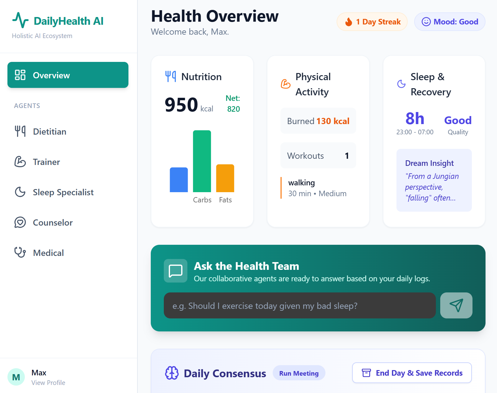
</div>

---

## 🌟 What is MedSage?

**MedSage** is a production-grade personal health intelligence platform designed to act as your **on-device medical expert**. It leverages the power of Google's specialized **MedGemma** model and a Multi-Agent Architecture to provide holistic, privacy-preserving health guidance. 

Unlike generalist AI models, MedSage possesses deep specialized knowledge of medical terminology, drug interactions, and clinical guidelines, ensuring all sensitive data processing happens safely and securely.

---

## 🧠 Core Innovation: The Multi-Agent Ecosystem

The system follows an **Agentic Workflow** where specialized AI personas collaborate under a Lead Coordinator to achieve comprehensive health monitoring and personalized recommendations. Every piece of advice is debated, reviewed, and finalized in a "Daily Consensus Meeting".

<div align="center">
  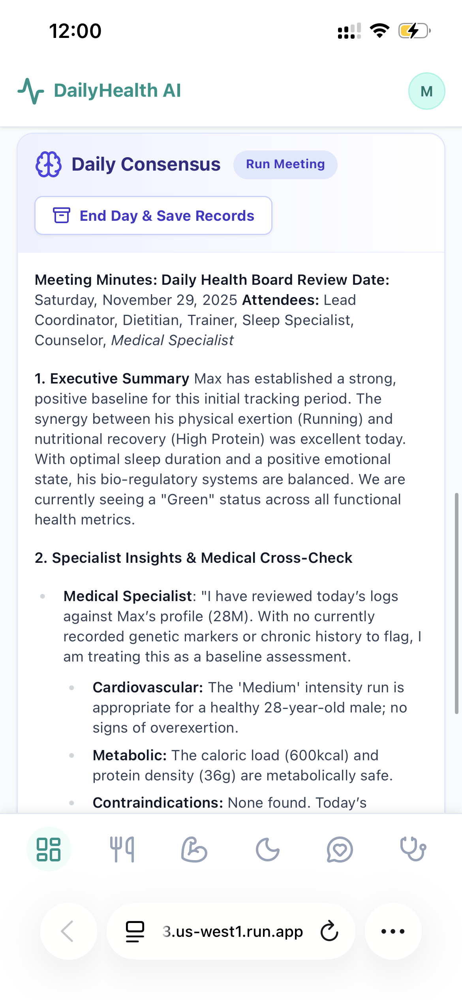
  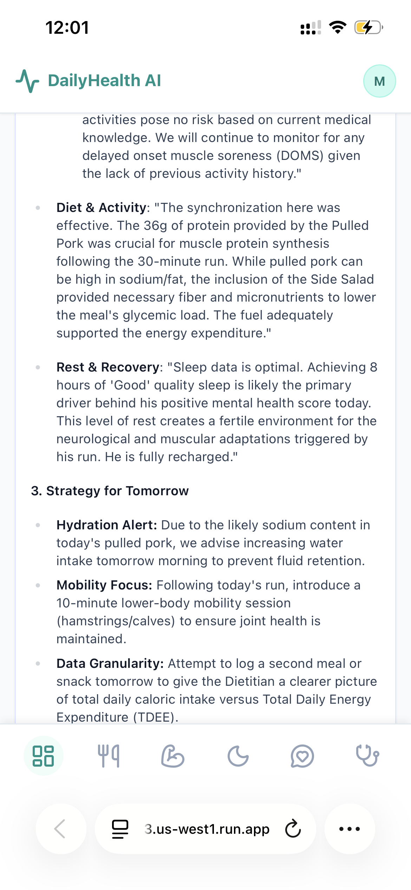
</div>

<br />

### 🩺 Medical Specialist (Powered by MedGemma)
The heart of the system. It acts as the clinical "safety check" for the entire ecosystem.
- **Clinical Q&A:** Answers user health concerns based on specific medical history and genetic risks.
- **Document Analysis:** Parses complex medical tests (blood panels, radiology) to extract key findings for the longitudinal record.
- **Cross-Agent Verification:** Reviews logs from the Dietitian and Trainer to identify potential contraindications (e.g., advising against high-intensity cardio if a heart condition is detected).

<div align="center">
  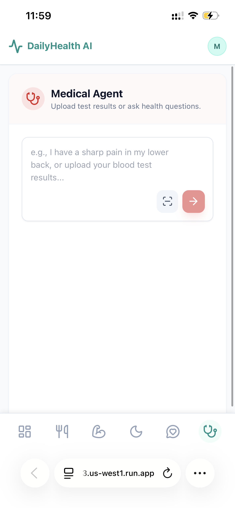
</div>

---

### 🤝 Meet The Health Specialists

<table align="center">
  <tr>
    <td align="center" width="50%">
      <h4>🥗 Dietitian</h4>
      <p>AI meal planning & calorie tracking. Suggests nutrition paths optimized for your health profile.</p>
      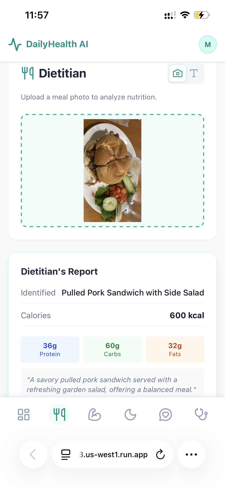
    </td>
    <td align="center" width="50%">
      <h4>🏋️ Trainer</h4>
      <p>Adaptive workout generation with strict safety checks based on the Medical Specialist's input.</p>
      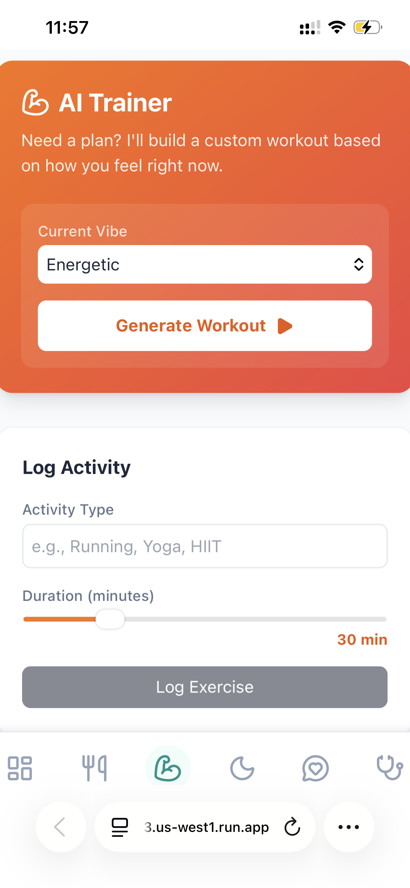
    </td>
  </tr>
  <tr>
    <td align="center" width="50%">
      <h4>💤 Sleep Specialist</h4>
      <p>Sleep cycle analysis and actionable optimization strategies for recovery and better rest.</p>
      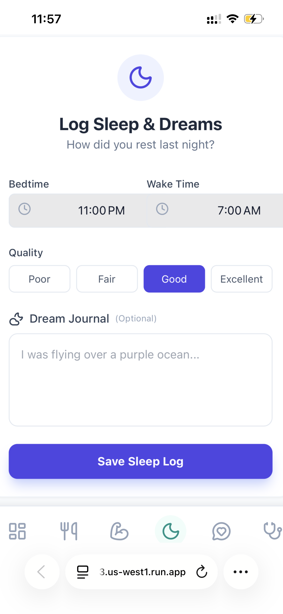
    </td>
    <td align="center" width="50%">
      <h4>🫂 Counselor</h4>
      <p>Provides empathetic mental health support, stress management, and daily emotional tracking.</p>
      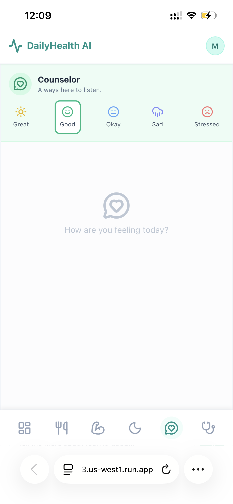
    </td>
  </tr>
</table>

---

## 📊 Comprehensive User Tracking & Dynamic Memory

MedSage maintains a "Dynamic Memory" that continuously aggregates daily logs, lab results, and personal history. It captures both static data (genetics, allergies) and dynamic daily inputs.

<table align="center">
  <tr>
    <td align="center" width="50%">
      <h4>Personal Profile</h4>
      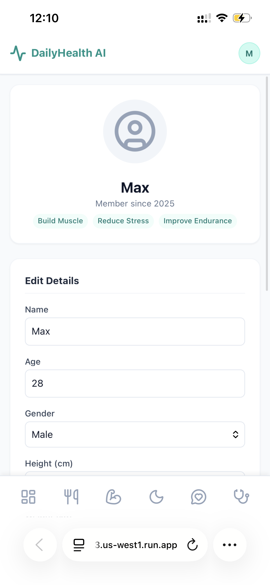
    </td>
    <td align="center" width="50%">
      <h4>Medical Records Vault</h4>
      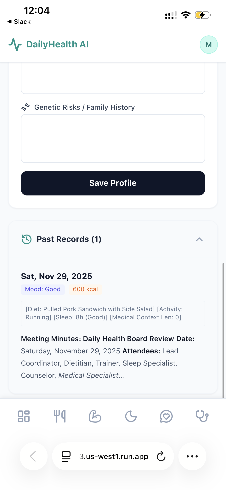
    </td>
  </tr>
</table>

---

## 🚀 Kaggle MedGemma Impact Challenge

*This application was created as a submission for the **MedGemma Impact Challenge**.*

### Why MedGemma makes an impact:
By utilizing MedGemma instead of a standard general-purpose LLM, MedSage provides:
1. **Clinical Specificity:** MedGemma's fine-tuning on robust medical datasets allows for more precise interpretation of complex medical terminology and risk factors.
2. **Privacy & Security Readiness:** As an open-weights model, MedGemma can be deployed locally or in HIPAA-compliant private environments. This ensures that a user's sensitive medical history **never leaves their controlled infrastructure**.

<div align="center">
  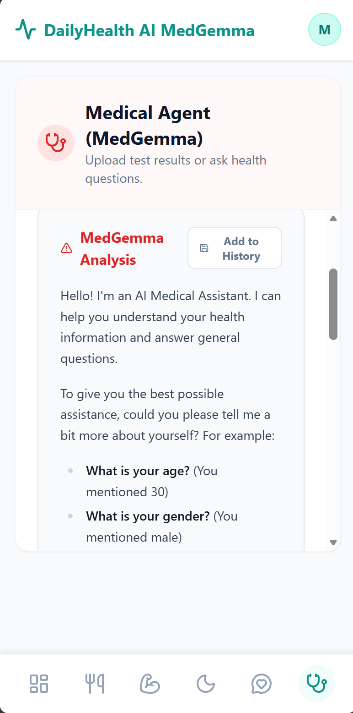
</div>

---

## 💻 Technical Stack

- **Frontend:** React 19, TypeScript, Vite
- **Styling:** CSS / Tailwind CSS
- **General Reasoning:** Google Gemini 3.1 APIs (handles non-clinical tasks)
- **Clinical Reasoning:** Google MedGemma-4B-IT
- **Database:** Supabase / PostgreSQL / Local SQLite

---

## 🛠️ Getting Started

### Prerequisites
- [Node.js](https://nodejs.org/) (v18 or higher)
- npm or yarn package manager
- Google Gemini API Key

### Installation

1. **Clone the repository**
   ```bash
   git clone https://github.com/yourusername/MedSage.git
   cd MedSage
   ```

2. **Install dependencies**
   ```bash
   npm install
   ```

3. **Environment Setup**
   Create a `.env.local` file in the project root:
   ```env
   VITE_GEMINI_API_KEY=your_gemini_api_key_here
   ```

4. **Run the development server**
   ```bash
   npm run dev
   ```

5. **Start Exploring**
   Open your browser and navigate to `http://localhost:5173`. You will be greeted by the login portal:

<div align="center">
  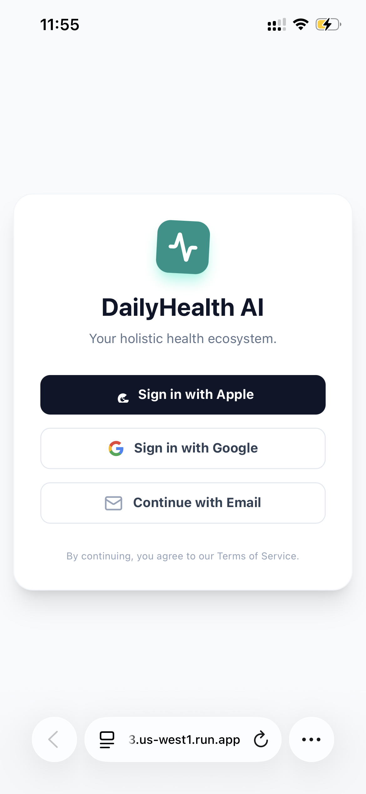
</div>

---

<div align="center">
  <i>Empowering Personal Health through Localized AI Intelligence.</i>
</div>